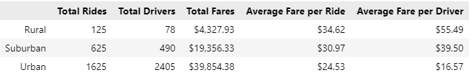
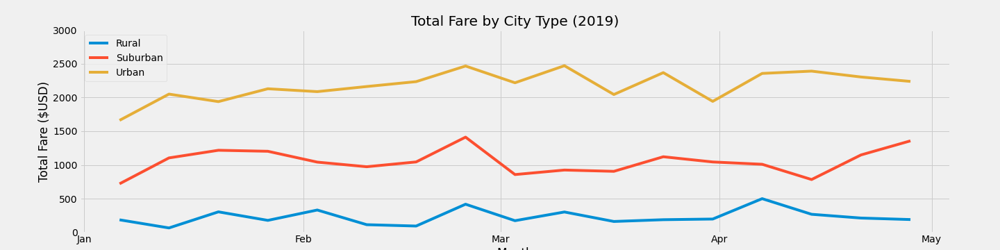

# PyBer Analysis

## Overview of Analysis 

The purpose of this analysis was to arrive at data-based, actionable recommendations regarding the disparities among city types for the ride sharing company, "PyBer". First, I used 2019 data to create a summary DataFrame of the ride-sharing data by city type. Then, using Pandas and Matplotlib, I created a multiple-line graph that shows the total weekly fares for each city type. Leading up to this analysis, I created several different types of graphs while exploring the data (box and whisker plots, pie charts, scatter bubble charts, bar charts including error bars) and created various groupings to inform the final analysis. These additional graphs and investigation can be found in the Additional Exercises folder and Initial_Analysis.ipynb, while the final analysis can be found in PyBer_Analysis.ipynb

## Results

### Summary DataFrame (2019)

We can see from the DataFrame that the columns representing the volume of business (rides, drivers, fare) is much lower in the less densely populated cities. These differences are not proportionate to one another, however. In terms of ride volume, suburban cities are at 2.5 times fewer rides than urban and rural at 13 times fewer rides than urban; the factor between city types in terms of fare is similar: 2 times less revenue for urban to suburban and 10 times less for urban to rural. In terms of total drivers, however, the difference between rural and urban is a factor of 30. 

This high density of drivers in urban city types leads to decreased average fares per ride for the customer but even more extremely decreased average fares per driver. We see a more moderate difference in fare per ride (a total of $10 difference between urban and rural) but a more extreme difference in fare per driver (a $40 or 70% difference). While the high volume of drivers in cities compared to rural areas resulting in decreased cost to the user might be considered advantageous, the stark difference in driver wages as represented by fare per driver is a concern. 

## Summary 

Business recommendations for addressing disparities among city types:

* In rural areas, we have fewer total drivers than total rides. Comparatively, we have 50% more total drivers than total rides in urban areas. Depending on further analysis on customer experience data, aiming to match the number of drivers more closely to the number of rides could result in less disparate customer prices and driver wages (as seen in the suburban areas with a smaller gap between volume of rides and drivers). 

* Aiming for the suburban ratio between total rides and total drivers represents a **small cost to the customer** (here, an increase in $6 per fare for the rider) and a **large benefit to the driver** (here, an increase in $23 per fare for the driver). Therefore, we can possibly use the **suburban ratio** as a starting point for adjusting the other city types. 

* To decrease the gap in average fare per driver, we could seek to increase the volume of drivers in rural areas to drive the average fare per driver down and/or we could seek to decrease the volume of drivers in cities to drive the average fare per driver up. Examples of efforts to this end could include a recruitment mechanism in the rural areas and a more selective application process in the urban areas. 

